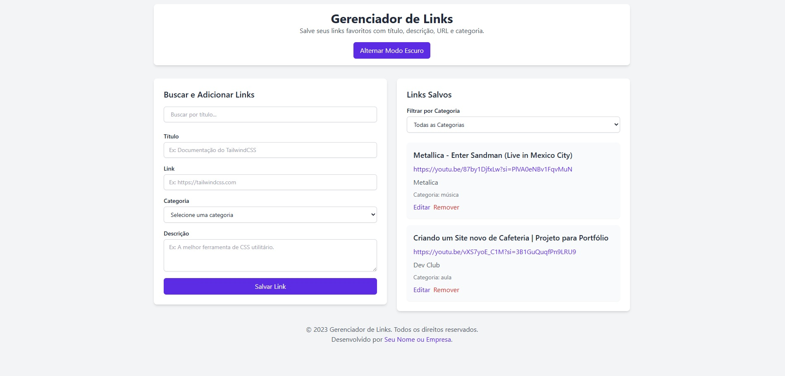

# Gerenciador de Links

 ;

Gerencie seus links favoritos com facilidade! O **Gerenciador de Links** é uma aplicação web simples e intuitiva que permite adicionar, editar, organizar e filtrar links salvos com títulos, descrições, URLs e categorias personalizadas.

## Índice

- [Visão Geral](#visão-geral)
- [Funcionalidades](#funcionalidades)
- [Como Usar](#como-usar)
- [Instalação Local](#instalação-local)
- [Tecnologias Utilizadas](#tecnologias-utilizadas)
- [Contribuição](#contribuição)
- [Licença](#licença)

---

## Visão Geral

O **Gerenciador de Links** é uma ferramenta prática para organizar links importantes em um só lugar. Com uma interface limpa e responsiva, você pode salvar links com informações adicionais, como descrições e categorias, facilitando a organização e a busca posterior.

---

## Funcionalidades

- **Adicionar Links**: Insira links com título, descrição, URL e categoria.
- **Editar Links**: Atualize as informações de um link existente.
- **Remover Links**: Exclua links indesejados.
- **Filtragem por Categoria**: Visualize links específicos de acordo com a categoria selecionada.
- **Busca por Título**: Encontre links rapidamente digitando parte do título.
- **Modo Escuro**: Alterne entre o modo claro e escuro para melhor conforto visual.
- **Persistência de Dados**: Os links são salvos no `localStorage`, garantindo que os dados permaneçam disponíveis mesmo após recarregar a página.

---

## Como Usar

1. **Adicionar um Link**:
   - Preencha os campos "Título", "Link", "Categoria" e "Descrição" no formulário à esquerda.
   - Clique em "Salvar Link".

2. **Editar um Link**:
   - Clique no botão "Editar" ao lado do link desejado.
   - O formulário será preenchido automaticamente com os dados do link.
   - Faça as alterações necessárias e clique em "Atualizar Link".

3. **Remover um Link**:
   - Clique no botão "Remover" ao lado do link que deseja excluir.

4. **Buscar Links**:
   - Use o campo de busca no canto superior esquerdo para filtrar links pelo título.

5. **Filtrar por Categoria**:
   - Selecione uma categoria no menu suspenso para exibir apenas os links pertencentes a ela.

6. **Alternar Modo Escuro**:
   - Clique no botão "Alternar Modo Escuro" no cabeçalho para alternar entre os modos claro e escuro.

---

## Instalação Local

Para executar o projeto localmente, siga os passos abaixo:

1. **Clone o Repositório**:
   ```bash
   git clone https://github.com/seu-usuario/gerenciador-de-links.git
   cd gerenciador-de-links